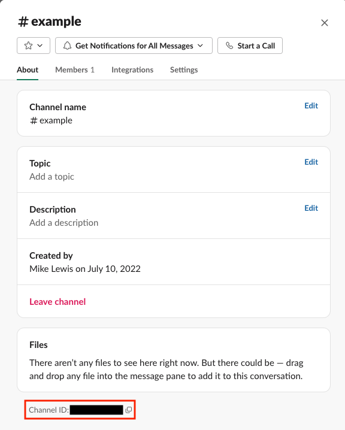

# Slack Message Client CLI #

This example target provides a command-line interface for sending a simple example Slack message to a configured channel.

This example should always be executed from inside this directory (since it searches for a configuration file here).

## Quick start ##

At the end of this quick start, you should be able to post an example message like the following to your configured channel:

<picture>
	<source media="(prefers-color-scheme: dark)" srcset="example-message-dark.png">
	
</picture>

### Setup ###

Derived from [Slack's setup guide for the equivalent GitHub Actions workflow](https://github.com/slackapi/slack-github-action/blob/main/README.md#technique-2-slack-app).

1. In this directory, copy `config.example.yaml` to `config.yaml`
2. [Create a Slack App](https://api.slack.com/apps) for your workspace (alternatively use an existing app you have already created and installed)
3. Add the [`chat.write`](https://api.slack.com/scopes/chat:write) bot scope under **OAuth & Permissions**
4. Install the app to your workspace
5. Copy the app's Bot Token from the **OAuth & Permissions** page and replace the example value for the key `authToken` in `config.yaml`
6. Invite the bot user into the channel you wish to post messages to (`/invite @bot_user_name`).
7. Click the channel name in the upper bar, then copy the channel ID from the resulting screen and replace the example value for the key `channel` in `config.yaml`:

<picture>
	<source media="(prefers-color-scheme: dark)" srcset="channel-id-callout-dark.png">
	
</picture>

### Sending messages ###

Here are some example commands for sending messages or showing help information about the CLI:

- `swift run`: send the exact example message shown above
- `swift run SlackMessageClientCli --help`: print the CLI's help messages (which show what values can be configured)
- `swift run SlackMessageClientCli --user Bunkyr`: replace the profile picture and username in the example above
